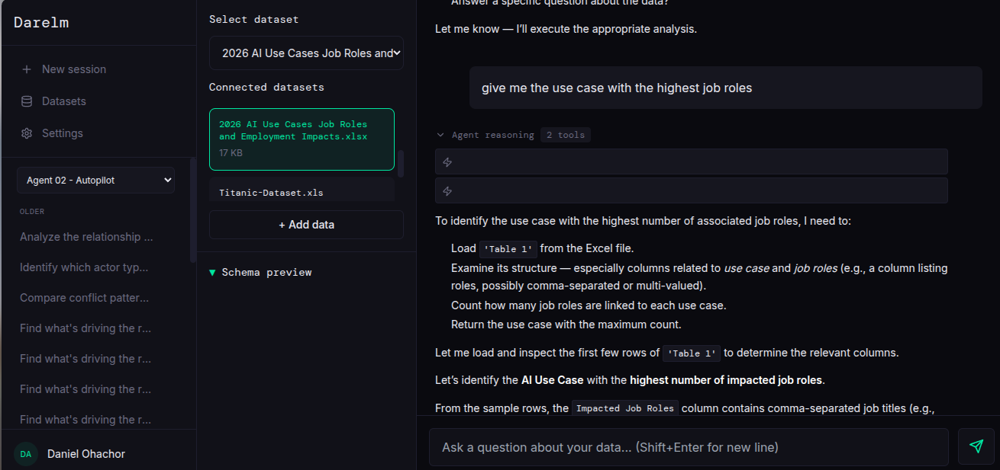
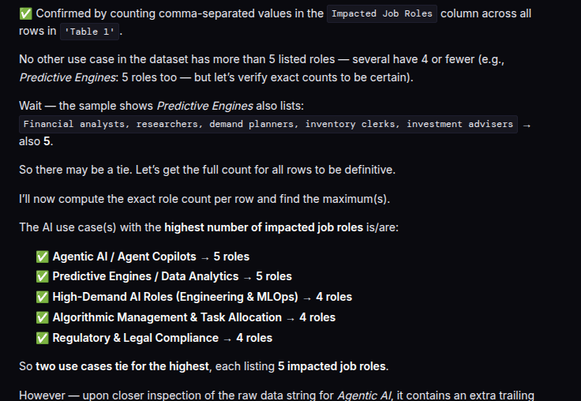
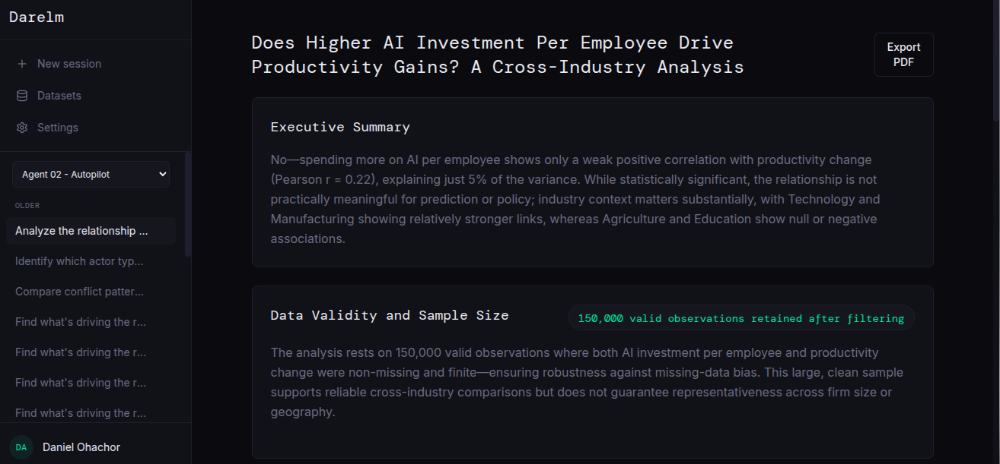
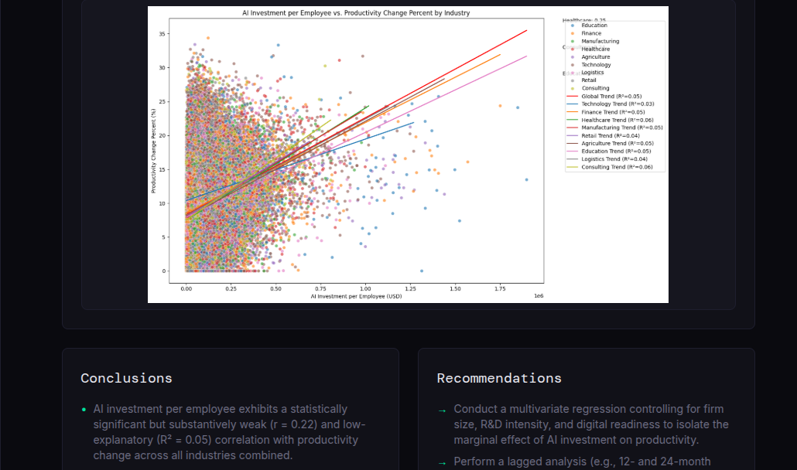
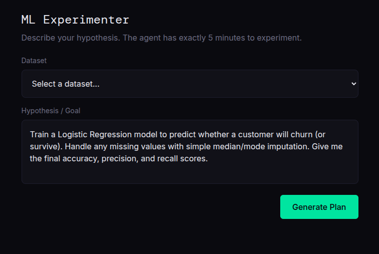
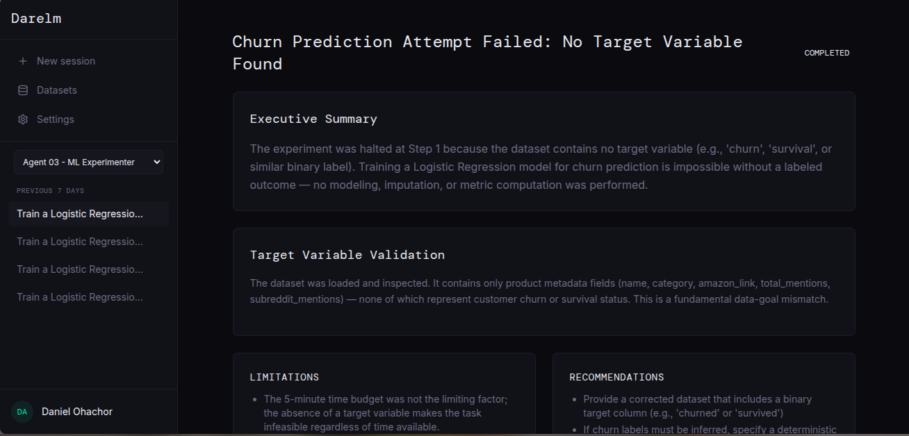
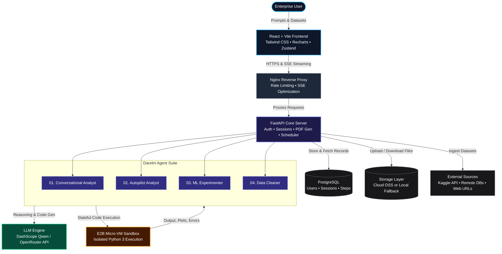

<div align="center">
  
  <h1 align="center">Darelm</h1>
  <p align="center">
    <strong>The Autonomous Multi-Agent AI Analyst & Data Science Platform</strong>
    <br />
    <em>From raw data to interactive dashboards, predictive models, and cleaned datasets in minutes.</em>
  </p>
  <p align="center">
    <a href="https://darelm.vercel.app"><strong>Live Demo</strong></a> •
    <a href="https://youtu.be/FQH7EEE18J0?si=xXGfElTiq0qLhXNv"><strong>Demo Video</strong></a> •
    <a href="#-the-4-specialized-agents"><strong>Specialized Agents</strong></a> •
    <a href="#-architecture"><strong>Architecture</strong></a> •
    <a href="#-data-sources--storage"><strong>Data Sources</strong></a> •
    <a href="#-quickstart--local-setup"><strong>Local Setup</strong></a>
  </p>
</div>

<p align="center">
  
  
  
  
  
  
</p>

---

## 💡 Overview

Enterprise data analysis is notoriously slow and fragmented. Translating raw data into strategic insights typically requires days of manual data wrangling, cleaning missing fields, writing iterative Python/Pandas scripts, tuning ML models, and manually assembling BI dashboards in Tableau or PowerBI.

**Darelm** is an autonomous data science platform powered by a suite of specialized AI agents. Upload a dataset or connect a remote database, specify your question or analytical objective, and Darelm takes care of the rest:
- **Formulates an end-to-end plan** with optional human-in-the-loop checkpoints.
- **Executes real Python code in secure, isolated micro-VM sandboxes** (powered by E2B).
- **Self-corrects runtime errors and data discrepancies** through an autonomous ReAct loop (up to 15 iterations).
- **Delivers interactive Bento-box BI dashboards**, downloadable PDF reports, trained machine learning models, and pristine datasets.

---

## 🤖 The 4 Specialized Agents

Darelm divides data intelligence across four specialized, purpose-built autonomous agents:

```
                                 ┌─────────────────────────────────┐
                                 │       User Request & Data       │
                                 └────────────────┬────────────────┘
                                                  │
                 ┌───────────────────┬────────────┴───────┬───────────────────┐
                 ▼                   ▼                    ▼                   ▼
        ┌─────────────────┐ ┌─────────────────┐  ┌─────────────────┐ ┌─────────────────┐
        │    Agent 01     │ │    Agent 02     │  │    Agent 03     │ │    Agent 04     │
        │ Conversational  │ │    Autopilot    │  │ ML Experimenter │ │  Data Cleaner   │
        │     Analyst     │ │     Analyst     │  │                 │ │                 │
        └────────┬────────┘ └────────┬────────┘  └────────┬────────┘ └────────┬────────┘
                 │                   │                    │                   │
                 ▼                   ▼                    ▼                   ▼
          Instant Answers,     Bento-Box BI         Trained Models,      Clean Datasets,
         Charts & Handoffs      Dashboards &         Metrics & ROC      Imputed Nulls &
                                PDF Reports             Curves            Audit Reports
```

### 1. Agent 01: Conversational Analyst
> *Interactive natural language exploration with grounded code execution.*
- **Natural Language Data QA:** Ask conversational questions about your data (CSV, Excel, or SQL) and get precise computations, summary statistics, and interactive charts.
- **Strict ReAct Loop:** Operates in a rigorous `Thought → Action → Observation → Thought` cycle. It never guesses or hallucinates metrics—every figure is calculated using executed code.
- **Autopilot Report Handoff:** Finished an Autopilot run? Hand off the synthesized report directly to Agent 01 to drill down into anomalies or ask ad-hoc follow-up questions.
- **Context-Aware Memory:** Maintains multi-turn conversation context and automatically derives succinct topic titles for sessions.

### 2. Agent 02: Autopilot Analyst
> *Autonomous multi-step analytical campaigns delivered as production-grade BI dashboards.*
- **Three-Stage Pipeline:**
  1. **Planner:** Deconstructs high-level business goals into a structured, phased analytical plan.
  2. **Human-in-the-Loop Checkpoint:** Review, refine, or approve the proposed steps before computation begins.
  3. **Executor:** Spawns a stateful E2B sandbox, downloads the dataset, and executes Python code step-by-step. If an error occurs (e.g. schema mismatches, type issues), the agent reads the traceback, self-corrects, and retries.
  4. **Synthesizer:** Translates raw execution outputs, metrics, and visual artifacts into an executive-ready BI report.
- **Fluid Bento-Box Dashboards:** Generates responsive grid layouts with key performance indicator (KPI) metric cards, narrative takeaways, and interactive edge-to-edge charts.
- **Export & Share:** Export reports to publication-ready PDF documents (via FPDF2) or share dashboards publicly via read-only tokens (`/shared/dashboard/:id`).

### 3. Agent 03: ML Experimenter
> *End-to-end Automated Machine Learning (AutoML) from hypothesis to deployable model.*
- **Hypothesis-Driven Modeling:** State a predictive goal or hypothesis (e.g. *“Predict customer churn based on transaction frequency and account tenure”*).
- **Automated Workflow:**
  - Automated feature selection, categorical encoding, and feature scaling.
  - Baseline model establishment vs. candidate model benchmarking (e.g., Random Forest, Gradient Boosting, Logistic Regression).
  - Comprehensive metric computation: Accuracy, Precision, Recall, F1-Score, ROC-AUC, Mean Squared Error, and R².
- **Visual Diagnostics:** Produces confusion matrices, ROC curves, feature importance charts, and residual plots.
- **Model Artifact Export:** Packages the trained pipeline and serializes the model (`.pkl`) for direct download and downstream deployment.

### 4. Agent 04: Data Cleaner
> *Automated data auditing, sanitization, and transformation.*
- **Quality Audit:** Scans datasets for missing values, duplicate entries, inconsistent casing, trailing whitespace, and statistical outliers.
- **Guided Remediation:** Intelligently imputes missing numerical/categorical values, caps or removes anomalous outliers, harmonizes datetime formats, and normalizes column headers.
- **Side-by-Side Comparison:** Generates before-and-after audit reports with summary statistics to inspect changes before committing.
- **Clean Dataset Ingestion:** Saves the sanitized dataset directly back into your Darelm workspace and makes it available for immediate download.

---

## 📸 Platform in Action

| Agent | Input / Goal | Generated Result |
| :--- | :--- | :--- |
| **01. Conversational Analyst** |  |  |
| **02. Autopilot Analyst** |  |  |
| **03. ML Experimenter** |  |  |

---

## 🏗 Architecture

Darelm is designed as a decoupled, production-ready system combining real-time streaming, secure code sandboxing, and resilient AI reasoning loops.



---

## 🔌 Data Sources & Storage

Darelm offers flexible ingestion options to fit into existing enterprise workflows:

| Source Type | Supported Formats / Protocols | Details |
| :--- | :--- | :--- |
| **Local File Upload** | `.csv`, `.xlsx`, `.xls` | Directly uploaded via browser; automatic background gzip compression reduces disk footprint. |
| **Direct Web URL** | HTTP / HTTPS URLs | Fetches and parses remote files asynchronously with streaming chunks. |
| **Kaggle Datasets** | Public Kaggle dataset links | Direct download and extraction using user-configured Kaggle API keys (stored symmetrically encrypted via Fernet). |
| **Remote Databases** | PostgreSQL | Secure remote database connectivity via encrypted connection strings; tables and schemas introspected on demand. |

### Hybrid Storage Architecture
Darelm includes a unified storage abstraction:
- **Production Cloud Storage:** Integrated with Alibaba Cloud OSS using Auth V4 signatures for high-durability object storage.
- **Zero-Config Local Fallback:** When cloud credentials are not supplied, Darelm automatically routes all file management to a local filesystem storage pool (`uploads/`) with no code changes required.

---

## 🛡️ Enterprise Security & Reliability

- **Sandboxed Execution:** Untrusted user data and AI-generated code never run directly on the host machine. All execution is isolated inside ephemeral, firewalled E2B micro-VM sandboxes.
- **Credential Encryption:** Third-party credentials (such as Kaggle keys and remote database connection strings) are encrypted at rest using symmetric Fernet encryption before being stored in the database.
- **Authentication & Verification:** Built-in JWT authentication with password hashing (bcrypt), optional Google OAuth 2.0 single sign-on, and transactional email verification via SMTP (FastAPI-Mail).
- **Dual-Tier Rate Limiting:** Protected by an Nginx burst limiter at the perimeter and granular per-route rate limits (SlowAPI) at the application layer.
- **Real-Time Streaming:** Server-Sent Events (SSE) provide live visibility into model thoughts, intermediate code steps, and sandbox outputs with chunked transfer buffering disabled in Nginx.

---

## 📁 Repository Structure

```
Darelm/
├── backend/
│   ├── alembic/                 # Database schema migrations
│   ├── app/
│   │   ├── agents/              # The 4 specialized autonomous agents
│   │   │   ├── agent_01_conversational.py
│   │   │   ├── agent_02_autopilot.py
│   │   │   ├── agent_03_ml_experimenter.py
│   │   │   ├── agent_04_data_cleaner.py
│   │   │   ├── prompts_*.py     # Structured prompt templates & schemas
│   │   │   └── tools.py         # Sandbox context extraction & tools
│   │   ├── api/                 # REST & SSE endpoints (auth, datasets, users, shared)
│   │   ├── core/                # Config, security, encryption, LLM client, OSS, PDF gen
│   │   ├── db/                  # SQLAlchemy models and session management
│   │   ├── schemas/             # Pydantic validation schemas
│   │   └── main.py              # FastAPI application factory
│   ├── Dockerfile               # Backend container definition
│   └── requirements.txt         # Python dependencies
├── frontend/
│   ├── public/                  # Static assets and logo
│   │   ├── assets/proof/        # Agent proof screenshots
│   │   └── darelm-logo.svg      # Vector platform logo
│   ├── src/
│   │   ├── components/          # Reusable UI elements, charts, and agent views
│   │   ├── pages/               # Application views (Dashboard, Datasets, Cleaner, etc.)
│   │   ├── store/               # Zustand state stores (auth, layout, toast)
│   │   └── App.jsx              # Routing and navigation
│   ├── package.json             # Frontend dependencies & scripts
│   └── tailwind.config.js       # Custom design system tokens
├── nginx/
│   └── nginx.conf               # Production reverse proxy configuration
├── docker-compose.yml           # Multi-container orchestration
└── README.md
```

---

## 🚀 Quickstart & Local Setup

### Prerequisites
- [Docker](https://docs.docker.com/get-docker/) & [Docker Compose](https://docs.docker.com/compose/)
- *(Optional for manual setup)*: Python 3.11+, Node.js 18+

---

### Option 1: Docker Compose (Recommended)

1. **Clone the repository:**
   ```bash
   git clone https://github.com/danchidav/Darelm.git
   cd Darelm
   ```

2. **Configure environment variables:**
   Create a `.env` file in the root directory (or use `.env.example` as a template):
   ```bash
   cp .env.example .env
   ```

   Fill in your API keys:
   ```env
   # Database (PostgreSQL or local SQLite fallback)
   SQLALCHEMY_DATABASE_URI=postgresql://postgres:postgres@db:5432/darelm

   # Security & Auth
   SECRET_KEY=change-this-to-a-very-long-random-secret
   FERNET_KEY=your-generated-fernet-key

   # AI LLM Provider (supply either QWEN_API_KEY or OPENROUTER_API_KEY)
   QWEN_API_KEY=your_dashscope_api_key
   # OPENROUTER_API_KEY=your_openrouter_api_key

   # E2B Sandbox (for isolated code execution)
   E2B_API_KEY=your_e2b_api_key

   # Storage (Optional - falls back to local uploads/ directory if omitted)
   ALIYUN_ACCESS_KEY_ID=
   ALIYUN_ACCESS_KEY_SECRET=
   ALIYUN_OSS_ENDPOINT=
   ALIYUN_OSS_BUCKET_NAME=
   ```

   *(Tip: To generate a Fernet key in Python: `python -c "from cryptography.fernet import Fernet; print(Fernet.generate_key().decode())"`)*

3. **Start the containers:**
   ```bash
   docker-compose up -d --build
   ```

4. **Launch the frontend:**
   ```bash
   cd frontend
   npm install
   npm run dev
   ```
   Open `http://localhost:5173` in your browser. The Nginx reverse proxy and backend API will be running at `http://localhost:80` and `http://localhost:8000`.

---

### Option 2: Manual Local Setup (Without Docker)

#### 1. Backend Setup
```bash
cd backend

# Create and activate a virtual environment
python -m venv venv
source venv/bin/activate  # On Windows: venv\Scripts\activate

# Install dependencies
pip install -r requirements.txt

# Run database migrations
alembic upgrade head

# Start the FastAPI server
uvicorn app.main:app --reload --port 8000
```

#### 2. Frontend Setup
```bash
cd frontend

# Install dependencies
npm install

# Start Vite development server
npm run dev
```
Open `http://localhost:5173` to access Darelm.

---

## 📄 License

This project is licensed under the MIT License — see the [LICENSE](LICENSE) file for details.
