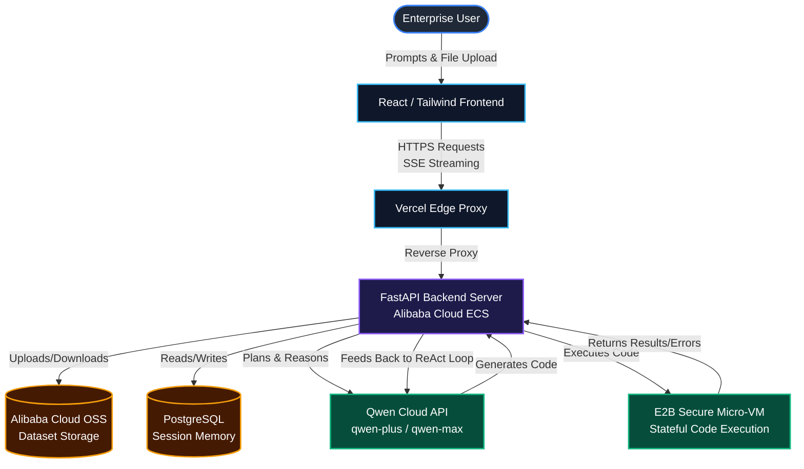

<div align="center">
  
  <h1 align="center">Darelm</h1>
  <p align="center">
    <strong>The Autonomous Enterprise AI Analyst</strong>
    <br />
    <em>Built for the Qwen Cloud Hackathon 2026</em>
  </p>
</div>

<p align="center">
  <a href="#-hackathon-track">Hackathon Track</a> •
  <a href="#-the-problem">The Problem</a> •
  <a href="#-features">Features</a> •
  <a href="#-architecture">Architecture</a> •
  <a href="#-proof-of-alibaba-cloud">Alibaba Cloud Proof</a> •
  <a href="#-local-setup">Local Setup</a>
</p>

---

## 🏆 Hackathon Track

**Track 4: Autopilot Agent**  
*Build an Agent that automates real-world business workflows end-to-end... Emphasis is on production-readiness over toy demos.*

**Demo Video:** [INSERT YOUTUBE LINK HERE]  

## 🚨 The Problem

Enterprise data analysis is slow and expensive. When an executive needs insights from a raw 500MB dataset, they typically must wait days for a data scientist to clean the data, write Pandas scripts, and manually construct a BI dashboard in Tableau or PowerBI.

**Darelm solves this.** Darelm is an autonomous, end-to-end AI Analyst. You simply upload a dataset and state your goal. Darelm's Autopilot Agent autonomously plans the analysis, writes and securely executes Python code, handles its own errors, and dynamically synthesizes a production-ready BI dashboard in under 3 minutes.

## ✨ Features

- **Autonomous Multi-Step Reasoning (ReAct):** Agent 02 doesn't just write scripts; it enters a secure execution loop. If a script throws a `TypeError` due to dirty data, Qwen reads the error, corrects its own code, and tries again (up to 15 self-correcting iterations).
- **Persistent Stateful Sandboxes:** Powered by E2B, Darelm boots a secure micro-VM for your session. It holds massive DataFrames in memory across dozens of reasoning steps.
- **Fluid Bento-Box Dashboards:** Darelm doesn't output plain text. It natively translates the AI's JSON findings into a responsive, premium "SaaS-style" CSS Grid dashboard with fluid KPI cards and edge-to-edge charts.
- **Enterprise Memory & Storage:** Datasets are securely stored in Alibaba Cloud OSS, and all sessions/dashboards are permanently saved in a PostgreSQL database for historical retrieval.

## 🏗 Architecture

Darelm uses a multi-layered, production-grade architecture combining Alibaba Cloud infrastructure with modern web frameworks.



## ☁️ Proof of Alibaba Cloud

This project makes extensive, sophisticated use of Alibaba Cloud services, ensuring high availability and scalability:

1. **Qwen API (`backend/app/core/qwen.py`):** Heavy utilization of Qwen models for reasoning, planning, and code generation.
2. **Alibaba Cloud OSS (`backend/app/core/oss.py`):** We integrated `oss2` for secure cloud object storage. All user datasets are uploaded directly to Aliyun OSS buckets.
3. **Alibaba Cloud ECS:** The production backend is deployed on an Alibaba Cloud ECS instance, securely proxying requests from the Vercel frontend.

## 🚀 Local Setup

To run Darelm locally for judging:

### Prerequisites
- Docker and Docker Compose
- Node.js (for frontend development)

### Environment Variables
Create a `.env` file in the `backend/` directory:
```env
# Alibaba Cloud Configurations
QWEN_API_KEY=your_qwen_api_key
ALIYUN_ACCESS_KEY_ID=your_access_key
ALIYUN_ACCESS_KEY_SECRET=your_secret_key
ALIYUN_OSS_ENDPOINT=oss-cn-hangzhou.aliyuncs.com
ALIYUN_OSS_BUCKET_NAME=your_bucket_name

# E2B Sandbox
E2B_API_KEY=your_e2b_api_key

# Database
DATABASE_URL=postgresql://postgres:postgres@db:5432/darelm
```

### Running the Stack
1. **Start the Backend Infrastructure:**
   ```bash
   cd backend
   docker-compose up -d --build
   ```
   *This boots PostgreSQL, runs Alembic migrations, and starts the FastAPI server on port 8000.*

2. **Start the Frontend:**
   ```bash
   cd frontend
   npm install
   npm run dev
   ```
   *The frontend will be available at `http://localhost:5173`.*

---
*Built with ❤️ for the Qwen Cloud Hackathon 2026*
